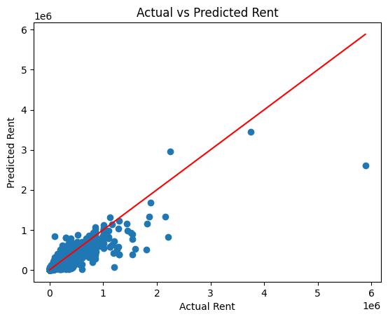
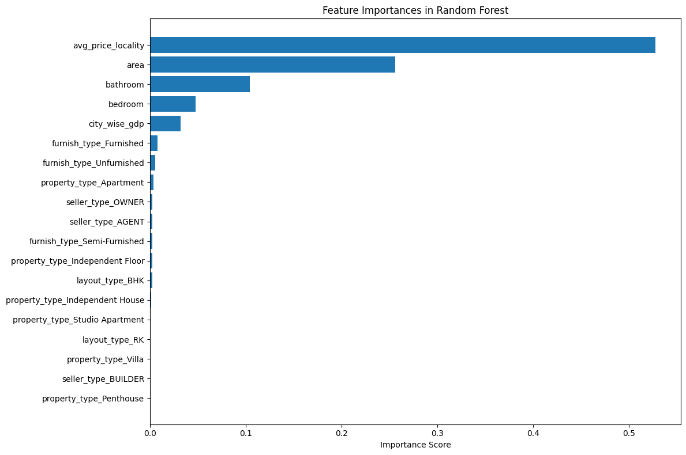

# House Rent Price Prediction using Machine Learning

Welcome to the **House Rent Price Predictor** for metropolitan Indian cities!  
This project uses **machine learning** to estimate rental prices based on property details such as area, layout, city, and locality. A **Streamlit** app provides an intuitive user interface.


## Objective

Build and deploy a machine learning model that can:
- Predict house rental prices in major Indian cities
- Incorporate both numerical and categorical features
- Provide a simple web-based prediction tool using Streamlit


## Project Structure

| File                | Description                                                   |
|---------------------|---------------------------------------------------------------|
| `notebook.ipynb`    | Full ML pipeline: EDA → preprocessing → training → evaluation |
| `app.py`            | Streamlit app code for user interaction and prediction        |
| `full_pipeline.pkl` | Full preprocessing pipeline (with custom transformers)        |
| `custom.py`         | Custom transformers for feature engineering                   |
| `requirements.txt`  | Dependencies list for deployment                              |


## Tech Stack

- **Language**: Python 3
- **Libraries**: numpy, pandas, matplotlib, seaborn, scikit-learn, streamlit
- **Model**: Linear Regressor, Random Forest Regressor
- **UI**: Streamlit (form + prediction + expanders)


## Model Performance

| Metric | Train Set | Test Set |
|--------|-----------|----------|
| R²     | 96.1%     | 86.4%    |
| RMSE   | 17945.58  | 35802.26 |
| MAE    | 4245.62   | 7328.64  |

Actual Vs Predicted Plot :


---
Feature Importance Plot : 



## Running Locally

```bash
git clone https://github.com/adarshr-20/rent-price-predictor.git
cd rent-price-predictor
pip install -r requirements.txt
streamlit run app.py
```


## Project Walkthrough 

**Data Loading**: 

Retrieved rental data from `Kaggle` containing listings across 8 Indian metropolitan cities.

**EDA & Cleaning**: 

Explored patterns, handled outliers, and addressed skewness using log transformation for `price` and `area`.

**Feature Engineering:**

Added `city_wise_gdp` to bring in economic context.

Introduced `avg_price_locality` for locality-based pricing.

**Preprocessing Pipelines:**

Custom transformers integrated with ColumnTransformer for numeric, categorical, and locality-specific features.

`Scaled` numerical features and `one-hot encoded` categoricals.

**Modeling:**

Trained using `RandomForestRegressor`, tuned with `RandomizedSearchCV`.

Achieved **~86%** accuracy on test data and **~96%** on train.

**Deployment:**

Built a clean **Streamlit app**. Allows user inputs and returns rent predictions in real time.


For detail explanation, refer to `notebook.ipynb`.


## Dataset

- Source: [Kaggle - House Rent Prices (India)](https://www.kaggle.com/datasets/saisaathvik/house-rent-prices-of-metropolitan-cities-in-india)
- Target: `price` (monthly rent)

## Note

> This model is built for **educational purposes only**.  
It is not suitable for production use without further validation and improvements.

## Creator

**Adarsh Rathore**  
📧 [adarshrathore165@gmail.com](mailto:adarshrathore165@gmail.com)  
🔗 [GitHub](https://github.com/adarshr-20) | [LinkedIn](https://www.linkedin.com/in/adarshr20/)
